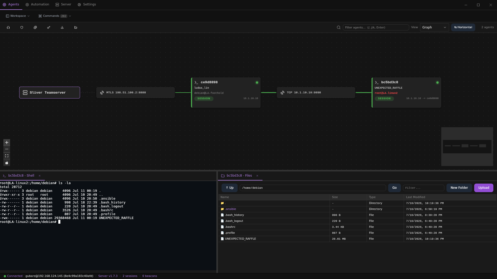
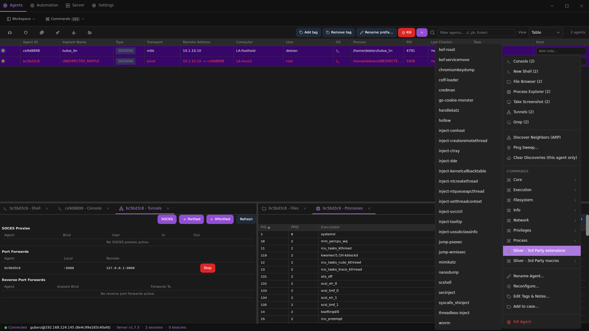
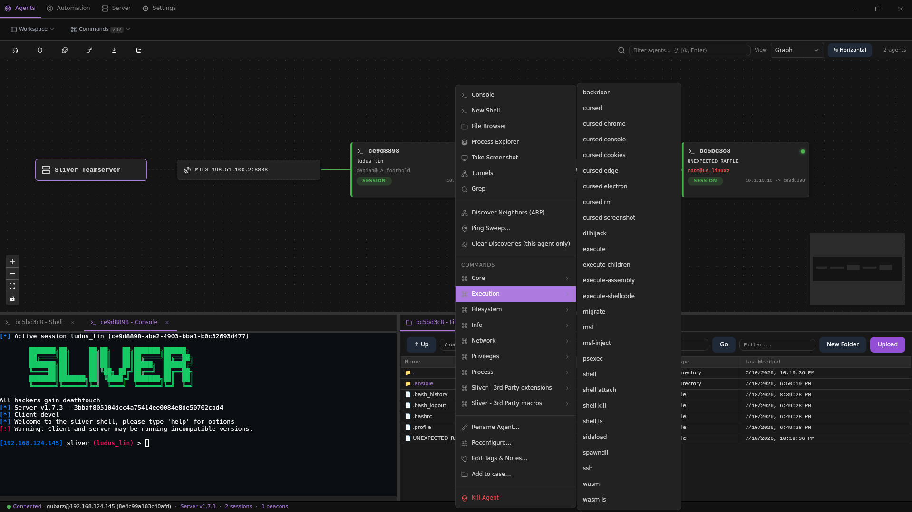
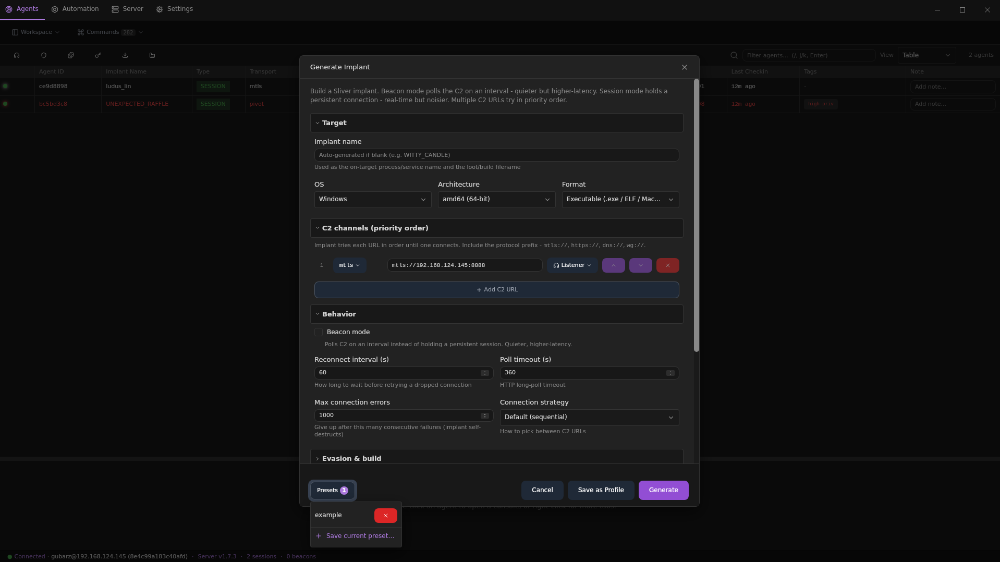
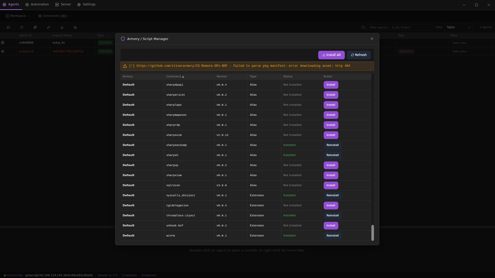
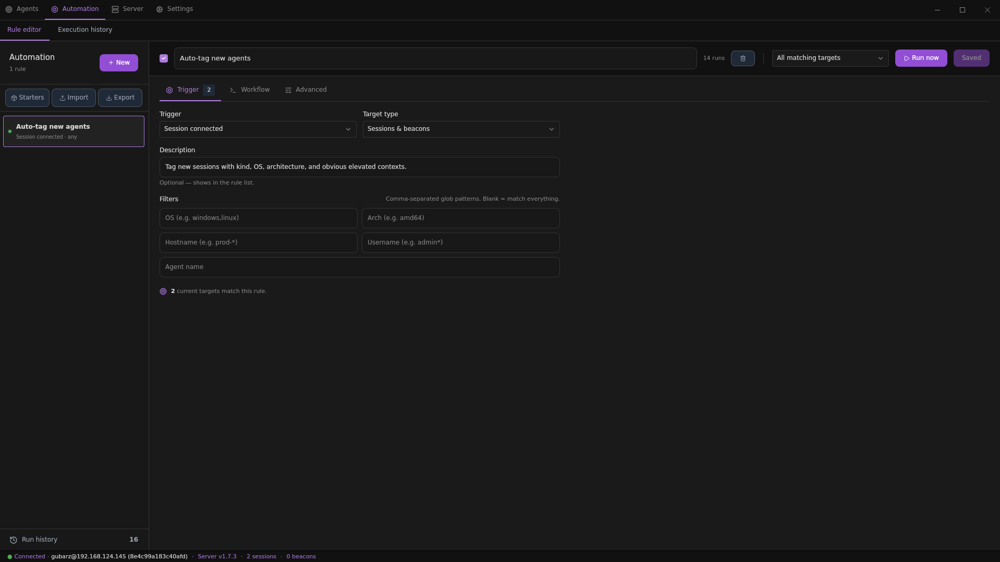
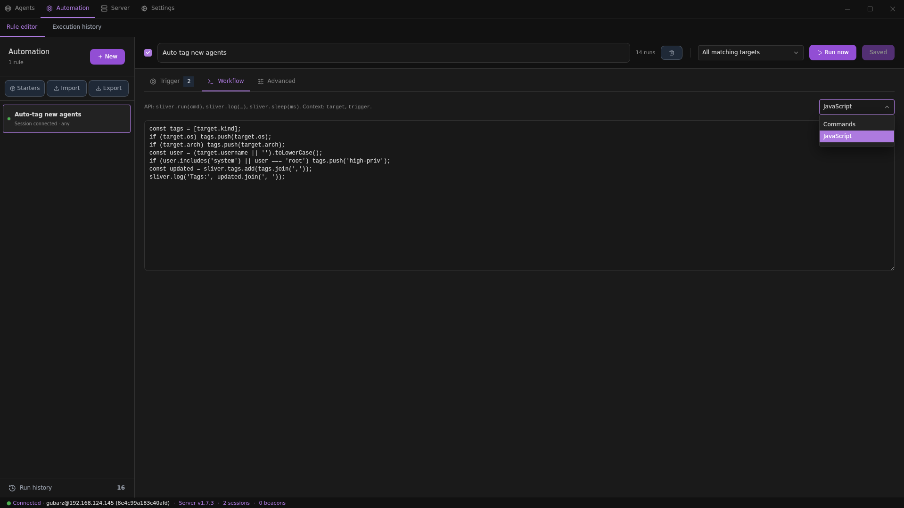

# Siren

[](https://github.com/Gubarz/siren/actions/workflows/ci.yml) [](LICENSE) [](go.mod) [](#build-it) [](https://github.com/Gubarz/siren/releases)

A desktop operator workbench for the [Sliver](https://github.com/BishopFox/sliver) C2 framework, built with [Wails v3](https://v3.wails.io), Go, Svelte 5, Vite, and Tailwind CSS.

**Authorized use only.** This is an offensive-security tool. Use it solely on systems you own or have explicit written permission to test.

## What It Is

`siren` wraps the Sliver client RPC surface in a native desktop shell. The Go backend owns the Sliver RPC client, long-lived streams, subprocess consoles, local files, and Wails bindings. The Svelte frontend provides the operator workspace, server management panels, command palette, automation editor, and app state.

The app starts disconnected. Import or select a Sliver client config, connect to a teamserver, then work from the main views:

- **Agents:** sessions, beacons, network graph, per-agent tabs, interactive consoles, file/process/registry/service tooling, tunneling, tags, notes, and command modals.
- **Server:** listeners, jobs, implant generation, profiles, build history, build farm, loot, credentials, hosts, operators, pivots, HTTP C2, websites, staging, traffic/shellcode encoders, monitoring providers, cracking, events, and cases.
- **Automation:** interval/event/manual rules with JavaScript scripts, starter rules, import/export, run history, and manual execution.
- **Settings:** theme, zoom, notifications, and health diagnostics.



## Screenshots

| Agent table and bulk actions | Command surface in graph view |
| --- | --- |
|  |  |

| Implant generation | Armory script manager |
| --- | --- |
|  |  |

| Automation triggers | Automation workflow |
| --- | --- |
|  |  |

## Feature Map

### Connection and Workspace

- Sliver client config discovery, import, export, delete, connect, reconnect, and disconnect.
- Global event stream with stored event history.
- Frameless Wails desktop window with custom title/status bars.
- Command palette with fuzzy search over views, panels, agents, and GUI actions.
- Agent workspace with table/graph modes, split bottom panes, draggable/reorderable tabs, bulk actions, tags, notes, and add-to-case flows.
- Theme support with multiple built-in themes, system theme detection, zoom settings, toast/dialog/context-menu systems, and keyboard shortcuts.

### Agent Operations

- Sessions and beacons listing, rename, kill/remove, beacon task inspection, task output, cancellation, beacon-to-session promotion, session close, integrity update, and reconfiguration.
- Real Sliver client subprocess consoles backed by xterm.js, with command completion, path completion, queued GUI commands, resize, stop, and interactive prompt support.
- Shell terminals with PTY support, output polling, resize, interrupt, and close.
- File browser with list, cd/pwd, upload, multi-upload/drop, download, recursive directory download, mkdir, remove, rename, copy, chmod/chown/chtimes, remote file viewing, text/hex viewers, and grep.
- Process explorer with list/tree views, kill, screenshot, migrate, procdump, getsystem, execute, execute-assembly, execute-shellcode, sideload, spawn-dll, backdoor, DLL hijack, make-token, impersonate, and run-as modals.
- Registry browser with subkey/value listing, read, write, create key, delete entry, and hive read.
- Windows service browser with list, start, stop, remove, and detail views.
- SOCKS5, port forward, reverse port forward, pivot listeners, WireGuard listener/client config, WireGuard SOCKS, and WireGuard TCP forwarding.
- Extension and WASM extension registration/list/call/exec.
- Memfiles list/add/remove.
- Network discovery via ARP/ping sweep with local OUI vendor lookup from the bundled IEEE registry.

### Server Operations

- Listener/job management for common Sliver listener protocols plus TCP stager listeners.
- Implant generation through basic and advanced request shapes, profile save/generate/delete, build history, regenerate/delete, staging selected builds, spoof metadata support, and distributed builder workflows.
- Server info, compiler, certificate authority info, certificates, aliases, canaries, operators, pivots, and pivot listeners.
- Loot, screenshots, agent notes, hosts/IOCs, and credential CRUD/update/filter/hash-type sniffing.
- Websites panel for listing/removing sites and adding/updating/removing content paths.
- HTTP C2 profile listing/lookup and JSON save.
- Traffic encoder listing/add/remove/test, shellcode encoder listing, shellcode RDI generation, and shellcode encoding.
- Monitoring provider start/stop/list/add/remove.
- Crackstation listing, crack job submit/cancel/lookup, crack file create/upload/download/complete/delete, and local-path crack file upload.
- Case files with create/update/delete, add/remove items from agents/loot/credentials/hosts/canaries, notes, and Markdown report generation.
- BloodHound CE integration as a data layer: HMAC-token connection management (Settings), server-side agent→AD-entity correlation with Tier-0/owned/distance chips on the sessions table, per-agent BloodHound tab with k-shortest attack-path graphs restricted to exploitable edge types, a BloodHound overlay layer on the network graph, and an action bridge mapping findings to Sliver operations (kerberoast, lateral movement, add-to-case, tag/comment).
- BloodHound ingest: collection upload jobs with per-file tracking and a drag-drop/upload panel; SharpHound/AzureHound pipeline (collector download with checksum verification → stage → run → exfil → ingest → loot) driven from the agent context menu or the `bloodhound_collect` automation action.

### Automation

- Automation rules stored in the app with enable/disable, create/edit/delete, run-now, import/export, and starter-rule import.
- Interval, event, and manual triggers.
- JavaScript scripting against Sliver targets.
- Run history with output, errors, status, and clear-history support.

Frontend feature code should call wrappers in `frontend/src/lib/api/`, not generated Wails bindings directly. More project conventions live in [CONTRIBUTING.md](CONTRIBUTING.md).

## Build It

You need Go, Node.js/npm, and the [Wails v3 CLI](https://v3.wails.io) (`go install github.com/wailsapp/wails/v3/cmd/wails3@v3.0.0-beta.7`). Install frontend dependencies once with:

```sh
npm --prefix frontend install
```

Common commands:

```sh
make dev          # frontend hot reload without auto-killing the Go backend
make dev-backend  # rebuild/restart backend on Go changes
make build        # produce a binary at /tmp/siren-build
```

Builds are stamped from Git. On a tagged commit, `git describe --tags` becomes the app version; otherwise it falls back to a descriptive commit value. Check what will be stamped with:

```sh
make print-version
make build
/tmp/siren-build --version
```

If you build with `go build` directly, use the `production` tag and pass the
same linker flags:

```sh
go build -tags production -trimpath -ldflags "-w -s $(make print-ldflags)" -o siren .
```

On Linux, Wails v3 uses GTK4 + webkitgtk-6.0 for the desktop webview by
default (`libgtk-4-dev libwebkitgtk-6.0-dev`). Distros that only package
webkit2gtk-4.1 (e.g. Ubuntu 22.04) can build the GTK3 variant instead:

```sh
BUILD_TAGS=gtk3 make dev
BUILD_TAGS=gtk3 make build
```

The dev loop is orchestrated by `wails3 dev` (see `build/config.yml`); it
starts the vite dev server, regenerates bindings, and rebuilds the Go binary
on change.

The macOS archive is currently unsigned and not notarized. Until signing is
configured, open it using Finder's **Open** context-menu action or remove its
quarantine attribute with `xattr -d com.apple.quarantine`.

## Quality Checks

Run the full project analysis with:

```sh
make analyze
```

That includes Go tests/vet/static analysis/dead-code/duplication checks plus frontend lint, dead-code, duplicate-code, and Vitest checks. You can run each side independently:

```sh
make analyze-go
make analyze-frontend
npm --prefix frontend run test:run
```

The frontend uses Svelte 5, Vite, Tailwind CSS, Flowbite Svelte, lucide icons, xterm.js, Fuse.js, Svelte Flow, and virtualized tables. `cmd/gui/app.go` is the small composition root, while Wails-facing methods are grouped by domain in `cmd/gui/bindings_*.go`.

## Data Maintenance

Network discovery performs local MAC vendor lookup from `internal/discovery/data/oui.tsv.gz`. Refresh it from IEEE registry sources with:

```sh
go run ./scripts/update_oui.go
```
